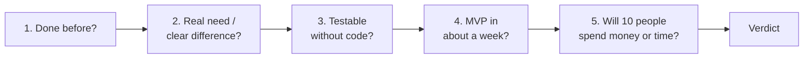

# Idea Worth Building

**A Claude skill that tells you whether your idea is worth coding — before you write a single line.**

You describe an idea. The skill researches the market (20+ web searches), runs the idea through a
5-gate decision tree, scores it with deterministic scripts, and hands back a report with a coloured
decision map and one of four verdicts: **GO · VALIDATE FIRST · PIVOT · NO-GO**.

It is designed to be willing to say *no*. Most ideas fail because nobody needs them or nobody pays
for them, not because the code was bad. This skill tries to find that out in an afternoon instead of
after three months of building.

[Türkçe açıklama aşağıda ↓](#türkçe)

---

## What's new in 1.1

Riskiest-assumption table, pain judged on severity × frequency × urgency, a confidence cap in the
scoring script, vendor-claim tagging and an existing-owner check. See [CHANGELOG](CHANGELOG.md).

## What you get

One Markdown report containing:

- **Decision map** — a Mermaid flowchart of the 5 gates, coloured by *your* idea's result (pass / fail / unknown)
- **Competitor analysis** — direct, indirect and "do-nothing" substitutes, with pricing and the top complaints from their reviews, plus a positioning quadrant chart
- **Market size** — TAM / SAM / SOM, bottom-up first, for your **local market vs global**
- **Test without code** — a concrete no-code experiment with a success threshold set in advance
- **MVP scope and cost** — one core feature, what to leave out, cost per active user
- **Unit economics** — LTV, CAC payback, break-even and 12-month scenarios, computed by a script
- **Distribution, founder fit and risks**, plus a devil's-advocate section
- **Score and verdict** — weighted 0–100 score with an uncertainty range
- **30-day validation roadmap** — a Mermaid gantt with a continue/stop point each week
- **Sources** — every verified claim is linked

## The 5 gates



## How it stays honest

- **Evidence tags on every claim:** `[✓ Verified]` (linked source), `[~ Estimate]` (assumption shown), `[? Needs you]` (only you can find out, e.g. by talking to users).
- **Scores come from scripts**, not from the model's mood. The model assigns 1–5 per criterion with a confidence level; `score.py` does the math and the verdict.
- **Kill criteria** force NO-GO regardless of score — e.g. a free dominant competitor with no real difference, or negative unit economics.
- **GO requires real-world evidence.** Desk research alone can reach at most VALIDATE FIRST; GO needs your user conversations and ~10 people committing money or time.
- **A quality gate** (`check_report.py`) checks the report before delivery: sections, diagrams, evidence tags, sources, search count, leftover placeholders, and whether the Mermaid diagrams actually render.

## Works for any idea, any country

- **Goal profiles:** `commercial` (default), `portfolio`, `internal` tool, `opensource` — a portfolio project isn't penalised for having no revenue model.
- **Idea types:** B2C app, B2B SaaS, marketplace, API/devtool, AI-wrapper, hardware/IoT, content/education, e-commerce — each with its own checks and pitfalls.
- **Any local market:** a generic method for any country plus shortcut packs for Türkiye, US, EU, UK, India, Southeast Asia, MENA and Latin America.
- **Any language:** the report is written in the language you use.

## Modes

| Mode | When |
|---|---|
| New analysis (default) | Full deep research, 20+ searches |
| Quick scan | Only if you ask for a fast check — 8–12 searches, verdict capped at VALIDATE FIRST |
| Re-evaluation | You come back with interview or test results; only affected gates are updated, old vs new score shown |
| Pivot exploration | On a PIVOT verdict: 2–3 alternative angles researched, scored and compared |

## Installation

**What you need:** a Claude account (Free, Pro, Max, Team or Enterprise) with **Code execution** and
**web search** turned on. No coding or GitHub knowledge is needed for the Claude.ai / desktop app route.

### Claude.ai or the Claude desktop app (no coding, about 2 minutes)

1. **Download the skill:** [idea-worth-building.zip](https://github.com/ZeynepBehsi/idea-worth-building/releases/latest/download/idea-worth-building.zip) (latest release). Don't unzip it.
2. **Turn on code execution:** Settings → Capabilities → *Code execution and file creation* → on. (Team/Enterprise: your admin may need to enable Skills first.)
3. **Upload:** Customize → Skills → **+** → *Create skill* → *Upload a skill* → choose the zip.
4. **Check it's on:** the skill appears in your list with its toggle switched on.
5. **Try it** in a new chat: *"Is this idea worth building? …"* (make sure web search is on).

**Updating to a new version:** delete the old skill from your Skills list, then upload the new zip.

> Downloaded the repository with *Code → Download ZIP* instead? That zip has an extra top-level
> folder and won't upload as-is. Use the release zip above.

### Claude Code

```bash
git clone https://github.com/ZeynepBehsi/idea-worth-building.git
cp -r idea-worth-building/idea-worth-building ~/.claude/skills/         # personal, all projects
# or: cp -r idea-worth-building/idea-worth-building .claude/skills/      # this project only
```

Optional: [`@mermaid-js/mermaid-cli`](https://github.com/mermaid-js/mermaid-cli) (`mmdc`) lets the
quality gate render-check the diagrams. Scripts use only the Python 3 standard library.

## Usage

Just describe your idea and ask. For example:

> I want to build an appointment-reminder SaaS for small veterinary clinics that sends WhatsApp messages. Is it worth building? I'm based in Portugal.

> Is an open-source CLI that turns Figma frames into Flutter widgets worth building? It's mostly for my portfolio.

> I talked to 6 people about the idea you analysed; 4 have the problem and 2 want to pre-pay. Re-evaluate it.

If key details are missing, the skill asks one short batch of questions (who the first user is, how
it makes money, whether you've talked to users, your time and budget, any unfair advantage) and then
starts researching.

## Repository structure

```
idea-worth-building/
├── SKILL.md                      # workflow: intake → 5 gates → scoring → report → quality gate
├── references/
│   ├── research-playbook.md      # query templates, market sizing, search plan
│   ├── idea-types.md             # type-specific checks and pitfalls
│   ├── locale-packs.md           # where to find local-market data, per region
│   ├── scoring-rubric.md         # criteria, goal profiles, kill criteria, verdict rules
│   ├── report-template.md        # report structure
│   └── mermaid-templates.md      # diagram templates + syntax safety rules
└── scripts/
    ├── score.py                  # weighted score, uncertainty range, verdict
    ├── unit_economics.py         # LTV, CAC payback, break-even, 12-month scenarios
    └── check_report.py           # quality gate before delivery
examples/                         # illustrative script inputs
```

Try the scripts directly:

```bash
cd idea-worth-building
python scripts/score.py ../examples/scores.example.json --profile commercial --lang en
python scripts/unit_economics.py ../examples/unit-economics.example.json --lang en
```

## Limitations

- Desk research cannot replace talking to real users — that's why GO is locked behind real-world evidence.
- Market sizes and costs are estimates built from public sources; always check the linked sources and assumptions.
- Quality depends on what web search can reach; paywalled reports and private data are out of scope.
- This is a decision-support tool, not financial, legal or investment advice.

## Contributing

Issues and pull requests are welcome — especially new **locale packs** (local statistics offices,
complaint sites, payment providers, data-protection laws) and new **idea types**.

## License

[MIT](LICENSE)

---

## Türkçe

**Bir fikrin kodlamaya değip değmediğini, tek satır kod yazmadan önce söyleyen bir Claude skill'i.**

Fikrini anlatırsın; skill 20'den fazla web aramasıyla pazarı araştırır, fikri 5 kapılı bir karar
ağacından geçirir, script'lerle puanlar ve renkli bir karar haritası içeren bir rapor verir. Sonuç
dört karardan biridir: **GO · ÖNCE DOĞRULA · PIVOT · NO-GO**.

Skill'in temel özelliği *hayır* diyebilmesidir. Fikirlerin çoğu kod kötü olduğu için değil, kimse
ihtiyaç duymadığı ya da para ödemediği için başarısız olur. Bu skill bunu üç ay geliştirme yaptıktan
sonra değil, bir öğleden sonra içinde anlamanı sağlamaya çalışır.

**Raporda neler var:** 5 kapıdaki yolunu gösteren karar haritası, rakip analizi (fiyatlar ve
kullanıcı şikayetleri) ve konumlandırma grafiği, yerel pazar ile global karşılaştırmalı TAM/SAM/SOM,
kodlamadan test planı, MVP kapsamı ve kullanıcı başı maliyet, birim ekonomisi (LTV, CAC geri dönüş,
başabaş, 12 aylık senaryolar), dağıtım, riskler, şeytanın avukatı, 0–100 puan ve 30 günlük doğrulama
yol haritası. Her iddia `Doğrulandı / Tahmin / Senin cevabın gerek` olarak etiketlenir ve kaynaklar
listelenir.

**Dürüstlük mekanizmaları:** puanı model değil script hesaplar; bedava ve baskın bir rakip varken
fark yoksa ya da birim ekonomisi negatifse sonuç puandan bağımsız NO-GO olur; GO kararı için gerçek
kullanıcı kanıtı (görüşmeler ve para/zaman harcayan ~10 kişi) gerekir. Rapor teslim edilmeden önce
bir kalite kontrol script'inden geçer.

**Her fikir ve her ülke için:** ticari, portföy, şirket içi araç ve açık kaynak profilleri; B2C,
B2B SaaS, marketplace, devtool, AI-wrapper gibi fikir tipleri; Türkiye dahil birçok bölge için
kaynak paketleri. Rapor, kullandığın dilde yazılır.

**Kurulum (Claude.ai / masaüstü uygulaması, kod bilgisi gerekmez, ~2 dakika):**

1. **İndir:** [idea-worth-building.zip](https://github.com/ZeynepBehsi/idea-worth-building/releases/latest/download/idea-worth-building.zip) — zip'i açma.
2. **Kod çalıştırmayı aç:** Ayarlar → Capabilities → *Code execution and file creation* → açık. (Team/Enterprise'da önce yöneticinin Skills'i açması gerekebilir.)
3. **Yükle:** Customize → Skills → **+** → *Create skill* → *Upload a skill* → zip'i seç.
4. **Kontrol et:** skill listede görünsün ve anahtarı açık olsun.
5. **Dene:** yeni bir sohbette web aramasının açık olduğundan emin ol ve *"Bu fikir kodlamaya değer mi? …"* diye yaz.

**Güncelleme:** eski skill'i listeden sil, yeni zip'i yükle. Claude Code kullanıyorsan klasörü
`~/.claude/skills/` altına kopyalaman yeterli.

**Kullanım:** Fikrini yaz ve "bu fikir kodlamaya değer mi?" diye sor. Görüşme veya test sonuçlarıyla
geri gelirsen skill fikri yeniden değerlendirir.

Bu bir karar destek aracıdır; finansal, hukuki veya yatırım tavsiyesi değildir.
