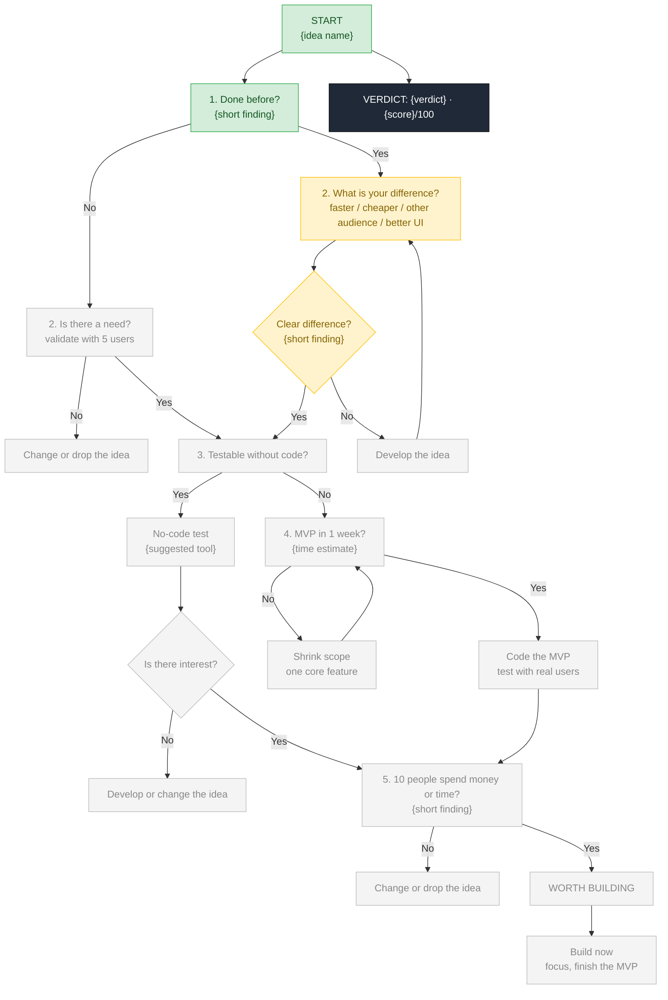
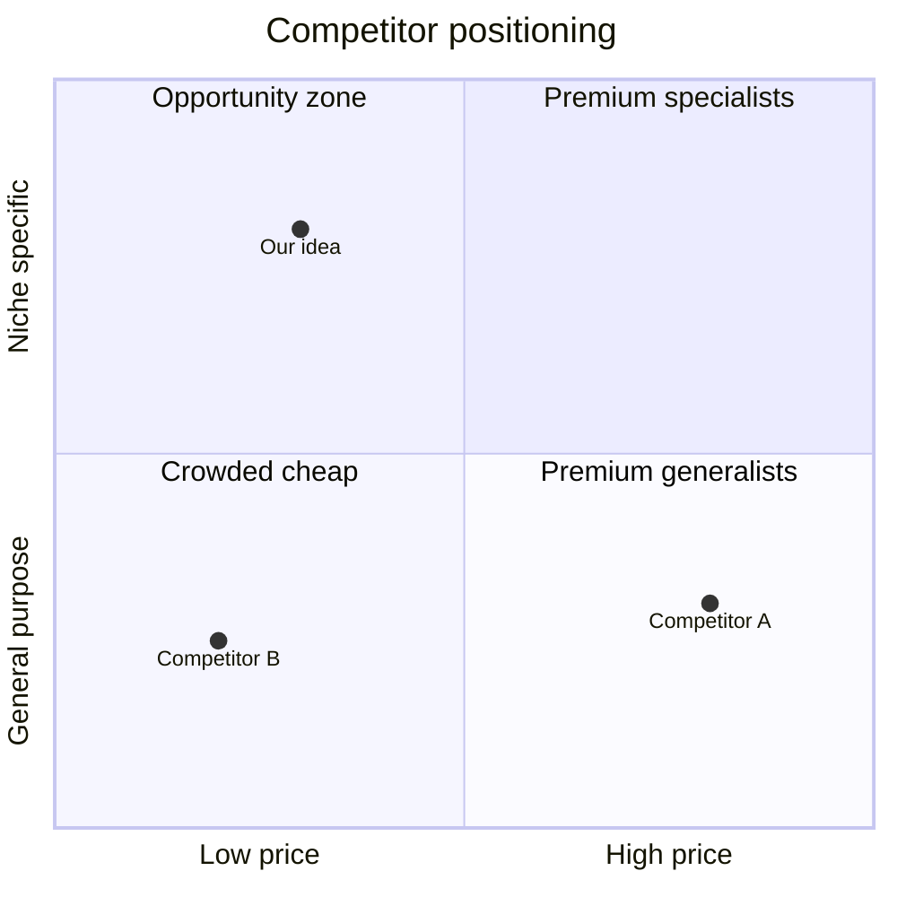

# Mermaid Templates

Write all labels in the report language. Templates are in English; a Turkish glossary is at the end.
Replace every `{...}` with real content — the quality-gate script fails on leftover placeholders.

## Syntax safety rules (broken diagrams are the most common failure)

- Wrap node labels in double quotes: `A["Gate 1: Done before?"]`. Non-ASCII letters are fine inside quotes in flowcharts.
- Never put `"` inside a label; use `'`. Avoid `#`, `;`, `{}`, `<>` in label text. Line break: `<br/>`.
- Edge labels: `A -->|"Yes"| B`. Node IDs: ASCII, no spaces.
- Every flowchart node gets exactly one class: `pass`, `fail`, `unknown` or `idle`.
- quadrantChart and gantt text: prefer plain ASCII (drop diacritics, no quotes/parentheses/colons in names) — some renderers fail otherwise. Quadrant coordinates between 0 and 1.
- gantt: `dateFormat YYYY-MM-DD`, start from the analysis date, ASCII task IDs.
- After writing, render with `check_report.py` (uses `mmdc` if installed); otherwise re-read each block for syntax errors.

## 1. Decision map (5 gates, coloured by this idea's result)

Mark every node on the path the idea actually took as `pass` / `fail` / `unknown`; untraveled nodes `idle`.
Put a short evidence note in each gate label (e.g., "12 competitors found").


(The `class` lines are an example — set them from the analysis. Gates waiting on the founder's real-user evidence are `unknown`.)

## 2. Competitor positioning quadrant

Choose the two axes that best expose the gap (price vs specialisation, ease vs depth, local vs global…).
Plot real competitors and the idea itself.



## 3. 30-day validation roadmap

Replace `{START_DATE}` with the analysis date (YYYY-MM-DD). Tie each week to a gate and a go/stop point.

```mermaid
gantt
    title 30 day validation roadmap
    dateFormat YYYY-MM-DD
    section Week 1 - Need
    5 user interviews              :w1a, {START_DATE}, 5d
    Review interviews go or stop   :milestone, w1m, after w1a, 0d
    section Week 2 - No-code test
    Landing page and waitlist      :w2a, after w1m, 3d
    Share in communities           :w2b, after w2a, 4d
    section Week 3 - MVP
    One-feature MVP                :w3a, after w2b, 7d
    section Week 4 - Payment
    Pre-sale offer to 10 people    :w4a, after w3a, 7d
    Decision                       :milestone, w4m, after w4a, 0d
```

## Turkish glossary

START → BAŞLANGIÇ · Done before? → Daha önce yapıldı mı? · Is there a need? → İhtiyaç var mı? ·
What is your difference? → Senin farkın ne? · Clear difference? → Net fark var mı? ·
Develop the idea → Fikri geliştir · Change or drop the idea → Fikri değiştir / iptal et ·
Testable without code? → Kodlamadan test edebilir misin? · Is there interest? → İlgi var mı? ·
MVP in 1 week? → MVP'yi 1 haftada çıkarabilir misin? · Shrink scope → Kapsamı küçült ·
10 people spend money or time? → Buna para veya zaman harcayacak 10 kişi bulabilir misin? ·
WORTH BUILDING → KODLAMAYA DEĞER · Build now → Şimdi kodla · VERDICT → KARAR ·
Yes/No → Evet/Hayır
